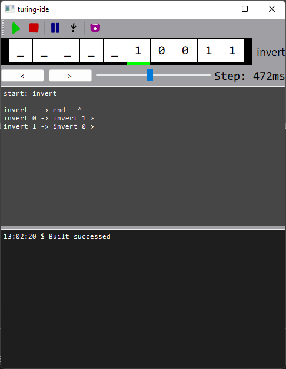

# IDE для классической машины Тьюринга

Приложение совмещает в себе возможность написания программ для машины Тьюринга, их запуска и тестирования.



Самая верхняя панель содержит 5 кнопок:
1) Запускает загруженную программу
2) Прерывает выполнение (следующий запуск начнётся со стартового состояния).
3) Останавливает выполнение программы с сохранением промежуточного её (программы) состояния
4) Шаг выполнения программы (исполняет одну инструкцию по нажатию)
5) "Компилирует" написанную программу.

Ниже панели кнопок находится изменяемая лента символов. Изначально лента заполнена '_' как знак пустоты.
Управляется с помощью клавиш `<` и `>` на клавиатуре либо с помощью кнопок ниже слева.

На третьем уровне находятся инструменты изменения положения текущего положения *головки записи-чтения* и времени затрачиваемого на одну команду программы.

Предпоследни уровень - это текстовый редактор для написания программ. 
У программы есть стоя грамматика (синтаксис грамматики походит на синтаксис Antlr):
```
Program
    : StartStage '\n' CommandList 
    ;

StartStage
    : 'start: ' VALID_NAME
    ;

CommandList
    : epsilon
    | Command
    | Command '\n' CommandList
    ;

Command
    : StageSymbol '->' StageSymbol ACTION
    ;

StageSymbol
    : VALID_NAME SYMBOL 
    ;

VALID_NAME : [a-zA-Z0-9]+ ;
SYMBOL     : [a-zA-Z0-9]{1} ;
ACTION     : '<' | '>' | '^' ;
```

Окончательным уровнем являются логи компиляций программы.